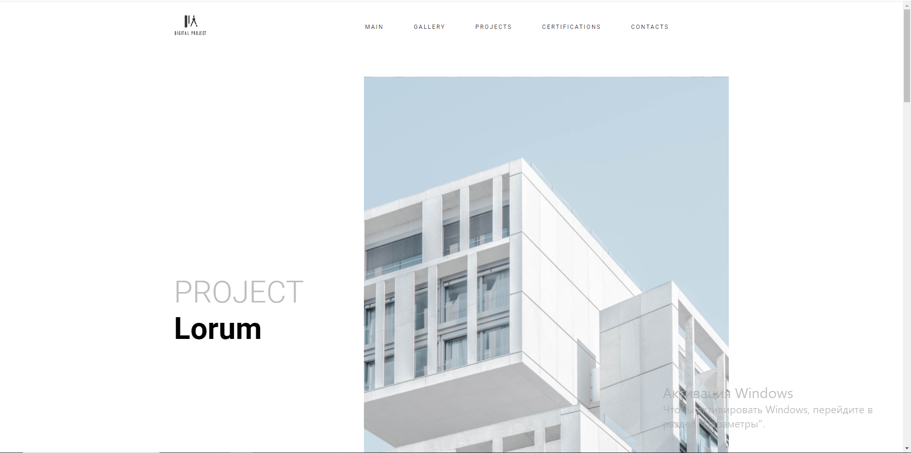
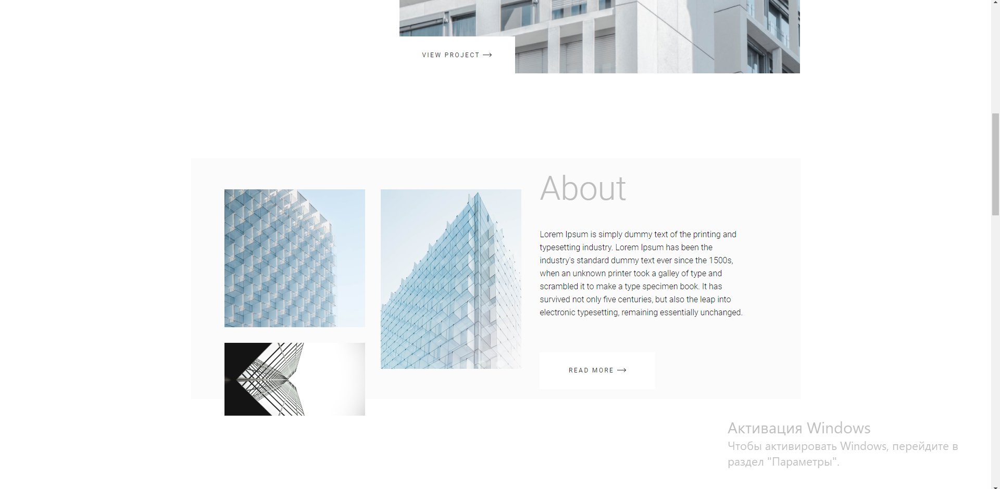
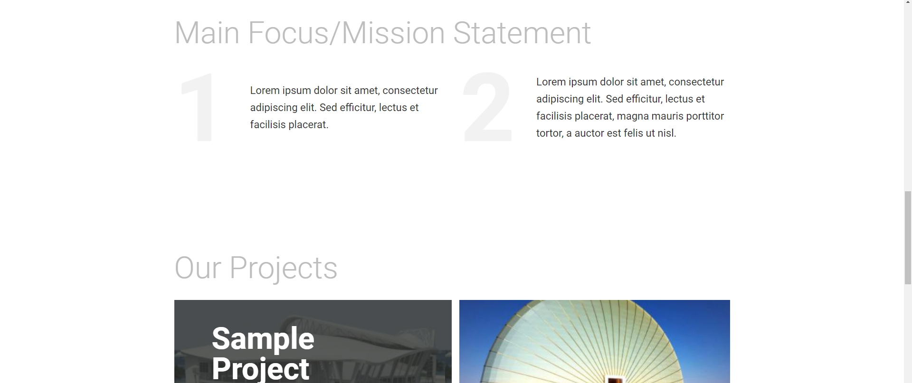
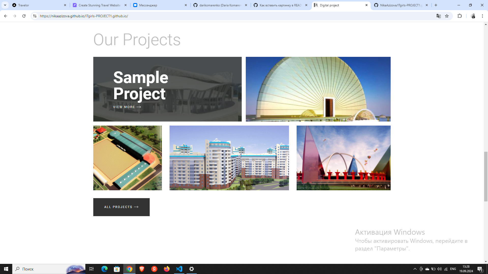
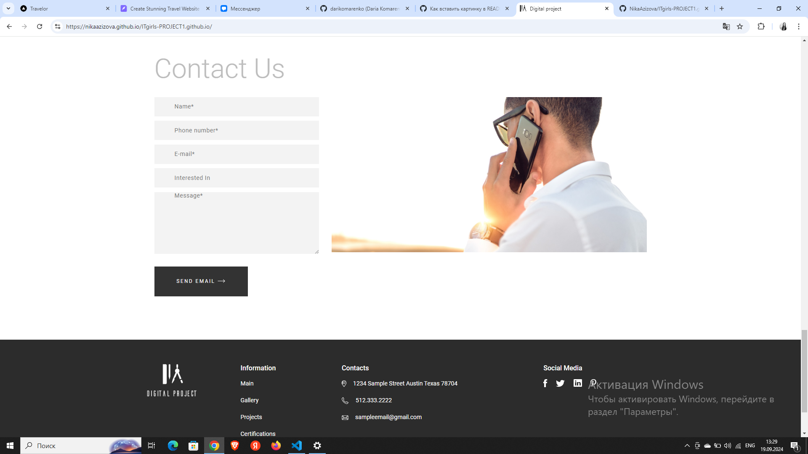
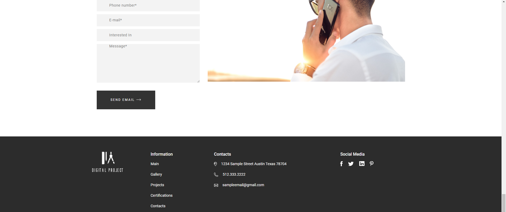
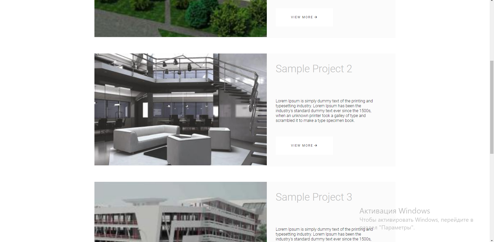
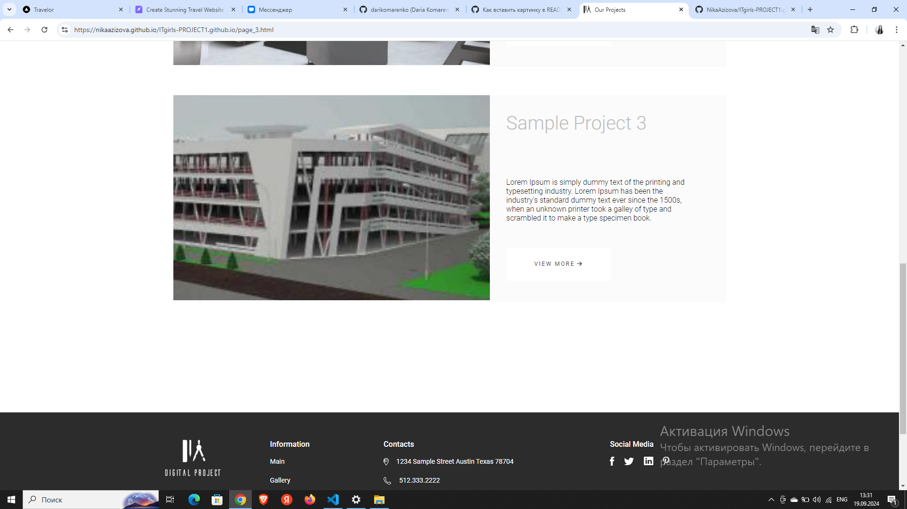

# ITgirls-PROJECT1

<h3><strong>Pet-Проект сайта по макету из Figma: </strong></h3>

https://www.figma.com/file/uqfBpnQ13FvprLasFXwF8O/Website-of-architects---free-website-(Community)-(Copy)?type=design&node-id=0-1&mode=design&t=XTgqNzMoCj8RgqX2-0

 
 

<strong>Сайт проекта: <strong>

https://nikaazizova.github.io/ITgirls-PROJECT1.github.io/

 

 

 

 

 

 

 

 

 

